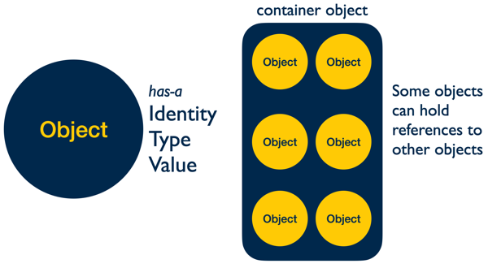

# SI 506 Lecture 03

## Topics

1. Comments (single line, block)
2. Values (objects) and types
3. Variables (labels) and variable assignment
4. Built-in functions `print()`, `type()`, `len()`
5. Basic arithmetic operations (add, subtract, multiply, divide)

<br />

## Vocabulary

* __Boolean__. A type (`bool`) or an expression that evaluates to either `True` or `False`.
* __Built-in Function__. A [function](https://docs.python.org/3/library/functions.html) defined by
  the Standard Library that is always available for use.
* __Dictionary__. An associative array or a map, wherein each specified value is associated with or
  mapped to a defined key that is used to access the value.
* __Immutable__. Object state cannot be modified following creation. Strings and tuples are immutable.
* __Mutable__. Object state can be modified following creation. Lists are mutable.
* __Operator__. A [symbol](https://www.w3schools.com/python/python_operators.asp) for performing
  operations on values and variables. The assignment operator (`=`) and arithmetic operators
  (`+`, `-`, `*`, `/`, `**`, `%`, `//`).
* __Sequence__. An ordered set such as `str`, `list`, or `tuple`, the members of which (e.g.,
  characters, elements, items) can be accessed.
* __Tuple__. An ordered sequence that cannot be modified once it is created.

<br/>

## 1.0 Comments

Explanatory text known as "comments" can be embedded in code with no impact on the runtime
characteristics of the program or script. In Python single line comments are delinated by prefacing
the line with a hash (`#`) character.

```python
# A single line comment
```

Successive lines of comments are considered a "block" comment.

```python
# A single line comment
# Yet another single line comment
# And yet another single line comment
```

You can also comment code rendering it inert and incapable of being interpreted (i.e., executed) at
runtime.

```python
# x = 5
# y = 2
# sum = x + y
```

You can also place a comment "inline" at the end of a line of code:

```python
welcome = 'Welcome to SI 506' # string
```

:bulb: Later in the course you will be introduced to documentation strings or "docstrings" which are
used to document classes, functions, and methods.

<br />

## 2.0 Values (Objects) and Types

<br />

>"Everything is an Object"

&nbsp;&nbsp;&nbsp;&nbsp;&nbsp;&nbsp;&nbsp;&nbsp;&nbsp;&nbsp;&nbsp;&nbsp;&nbsp;&nbsp;&nbsp;&nbsp;&nbsp;&nbsp;Jake VanderPlas, _A Whirlwind Tour of Python_ (O'Reilly Media, Inc., 2016)

> "Objects are Python's abstraction for data. All data in a Python program is represented by objects
> or by relations between objects."

&nbsp;&nbsp;&nbsp;&nbsp;&nbsp;&nbsp;&nbsp;&nbsp;&nbsp;&nbsp;&nbsp;&nbsp;&nbsp;&nbsp;&nbsp;&nbsp;&nbsp;&nbsp;Python Software Foundation, ["The Python Language Reference"](https://docs.python.org/3/reference/datamodel.html)

<br/>



<br/>

Python is an object-oriented programming language. This means that the Python
data model represents strings, integers, floating point numbers,
containers (e.g., `list`, `tuple`, `set`), mappings (`dict`), functions, class instances, modules
and other types as __objects__.

The basic characteristics of a Python object can be summarized as follows:

1. Every object possesses an _identity_ (memory address), _type_, and _value_.
2. An object’s _type_ determines its behavior as well as defines the possible values it may contain.
3. The value of some objects can be modified. An object's _mutability_ (e.g., _mutable_ = capable of
   modification; _immutable_ = incapable of modification) is determined by its _type_.
4. Objects are never explicitly destroyed; memory management and "garbage-collection" is typically
   ceded to the Python interpreter without the need for manual intervention.

<br />

## 2.1 Numbers: integer, float (decimal)

```python

506 # integer

.25 # float
```

<br />

## 2.2 Sequences

* string (ordered, immutable)
* list (ordered, mutable)
* tuple (ordered, immutable)
* set (unordered, mutable, but each element _must_ be immutable as well as unique)

```python
'I am a sequence of characters' # string

['arwhyte', 'brooksch', 'collemc', 'csev', 'cteplovs'] # list with five elements

(504, 506, 507) # tuple with three items

{27, 24, False, 7.5, True, 'text'} # each set element is immutable
```

A "multiline" string (actually a string constant) can also be defined using triple quotation marks
at the start and end of the string as in the following example which highlights the first few lines
of Amanda Gordon's poem
["The Hill We Climb"](https://news.harvard.edu/gazette/story/2021/01/amanda-gormans-inauguration-poem-the-hill-we-climb/) (2021).

:bulb: You can denote a multiline string by using either three double quotes (`"""`) or three single
quotes (`'''`).

```python
"""When day comes we ask ourselves,
‘where can we find light in this never-ending shade,’
the loss we carry,
a sea we must wade?
We’ve braved the belly of the beast.
We’ve learned that quiet isn’t always peace,
and the norms and notions
of what just is
isn’t always just-ice.
"""
```

<br/>

## 2.3 Dictionary (associative array)

A dictionary is composed of key-value pairs. Insertion order is maintained.

```python
{'course': 'SI 506', 'instructor_count': 1, 'gsi_count': 6, 'ia_count': 2} # four key-value pairs
```

<br />

## 2.4 Boolean

```python
True
False
```

<br />

## 2.5 None

`None` is an object of type `<class 'NoneType'>` and represents `null` or the absence of a concrete
value.

:exclamation: Note that `None` does not equal 0.

```python
None
```

<br />

## 3.0 Variable (name, label, pointer)

A Python _variable_ is a name or label that refers to an object in memory. Jake VanderPlus describes
the concept in _A Whirlwind Tour of Python_:

<br />

>“. . . variables are simply pointers [to objects], and the variable names themselves have no attached type information.”

<br />

Or as Naomi Cedar writes in _The Quick Python Book_, Third Edition (Manning Publications, 2018):

<br />

>"The name variable is somewhat misleading . . .; name or label would be more accurate.”

<br />

## 3.1 Variable assignment

You use the assignment (`=`) operator to _assign_ a value to a variable or _bind_ the name (i.e.,
pointer, label) to the object (e.g., `variable_name = < object >`).

```python
num = 506

welcome_message = 'Welcome to SI 506'

uniqnames = ['arwhyte', 'brooksch', 'collemc', 'csev', 'cteplovs'] # list literal

chorus = """Hail! to the victors valiant
Hail! to the conquering heroes
Hail! Hail! to Michigan
the leaders and best!
"""
```

<br />

## 4.0 Variable Naming Rules and Conventions

Default convention: lowercase word(s) or recognizable abbreviation (e.g., num, val, var);
separate words with an underscore.

:exclamation: Readability and comprehensibility matters. See the Python Community's
[Style Guide for Python Code (PEP 8](https://pep8.org/) (reformatted by Kenneth Reitz).

<br />

## 4.1 Good

```python
# Choose lowercase
uniqname = 'arwhyte'

# Separate words with underscore (_)
course_code = 'SI 506'

# Use plural form to indicate a set or sequence
course_codes = ['SI 506', 'SI 507', 'SI 618']

# Ok to use recognizable abbreviations like num[ber], val[ue] or var[iable].
num = 24

# "is_", "has_" prefix: Boolean True/False
is_enrolled = False
has_mask = True

# All caps designates a module level constant (special case)
BASE_URL = 'https://si506.org/'

# Function definition specifying two parameters x and y (a foreshadowing of the weeks ahead)
def multiply(x, y):
    return x * y # arithmetic

# Call the function and pass two numeric arguments
product = multiply(14, 24)

print(f"product = {product}") # formatted string literal (f-string)

# For loop incorporating a counter < i > value
course_codes = ['SI 564', 'SI 574', 'SI 579', 'SI 582']
i = 1 # counter
for code in course_codes:
    print(f"{i}. {code}")
    i += 1 # addition assignment (increment)

# Alternative: call built-in function enumerate()
for i, code in enumerate(course_codes, start=1):
    print(f"{i}. {code}")
```

<br />

## 4.2 Bad (But Legal)

```python
# Opaque
c = 'SI 506'
si = 'SI 506'

# Reserve CamelCase for class names.
CourseCode = 'SI 506' # correct name = course_code

# Not a fan of trailing data type suffixes (_list)
course_code_list = ['SI 506', 'SI 507'] # prefer course_codes (plural)
```

:exclamation: Avoid prefixing or suffixing variable names with single (`_`) or double underscores (`__`)
&mdash; known in the Python community as a "dunder" &mdash; until you gain experience as a Python
programmer.

Variable names prefixed with a single underscore like `_course_code` are, by convention, considered
private member variables in a class. Variable names prefixed with a double underscore like
`__course_code__`, gets renamed at runtime by the Python interpreter in a process known as "name
mangling".

:bulb: These and other naming conventions that employ leading and/or trailing underscores are
_out of scope_ for SI 506. That said, if you want to learn more on the subject see D. Bader,
["The Meaning of Underscores in Python"](https://dbader.org/blog/meaning-of-underscores-in-python)
(dbader.org, nd).

<br />

## 4.3 Ugly (Illegal)

The Python Interpreter will raise a `SyntaxError` at runtime whenever it encounters the following
illegal names:

:exclamation: Python [keywords](https://docs.python.org/3/reference/lexical_analysis.html#keywords)
are reserved and cannot be used as variable names.

```python
# Illegal: keyword used as a variable name (language-specific identifiers reserved by Python)

class = 'SI 506'

# Illegal: variable name commences with a numeric value.

506_umsi = 'SI 506'

# Illegal: variable name commences with a special character (e.g., `@`, `%`, `$`, `&`, `!`)

$number = 506

# Illegal: variable name includes a dash (`-`).

course-list = ['SI 506', 'SI 507', 'SI 618']

# Illegal: variable name includes whitespace.

course name = 'SI 506' # illegal; uncomment to test
```

:exclamation: Also avoid use of
[built-in function](https://docs.python.org/3/library/functions.html) names as variable names.
Name clashes may occur in your code. If you do opt to use or "shadow" such names add a trailing
underscore character to the name (`_`) per the
[PEP 08](https://www.python.org/dev/peps/pep-0008/#function-and-method-arguments) recommendation or
opt for a different name (`len_` or `length` for `len`).

```python
# Shadowing; risk name clash with built-in functions
id = 506
str = 'Go Blue'
min = 0
max = 27
len = 6

# Alternative names
id_ = 506

str_ = 'Go Blue'
val = 'Go Blue'

min_ = 0
min_val = 0

max_ = 27
max_val = 27

len_ = 6
length = 6
```

<br />

## 5.0 Built-in Functions (`print()`, `type()`, `len()`)

The Python Interpreter includes a number of
[built-in functions](https://docs.python.org/3/library/functions.html) that are always available for
you to call.

:bulb: A function is a defined block of code that performs (ideally) a single task. Functions only
run when they are explicitly called. A function can be defined with one or more _parameters_ that
allow it to accept _arguments_ from the caller in order to perform a computation. A function can
also be designed to return a computed value. Functions are considered "first-class" objects in the
Python eco-system. You will soon write your own functions; for now we introduce a select number of
built-in functions for you to use.

<br />

## 5.1 `print()`: print passed in argument to the screen

```python
# Passing a hard-coded string.
print('SI 506 rocks!')

# Passing a variable name which points to a string.
print(welcome_message)

# Passing a variable name which points to a multiline string.
print(chorus)
```

<br />

## 5.2 `type()`: determine object's data type

```python
data_type = type(num)
print(data_type) # returns <class 'int'>

data_type = type(welcome_message)
print(data_type) # returns <class 'str'>

data_type = type(uniqnames)
print(data_type) # returns <class 'list'>
```

<br />

## 5.3 `len()`: check length of a sequence (i.e., number of elements)

```python
# Count characters in string (including whitespace).
chars_count = len(welcome_message)
print(chars_count)

# Count number of elements in list.
uniqname_count = len(uniqnames)
print(uniqname_count)
```

<br />

## 5.4 Challenge 01

__Task__: Create a list of strings that represent three popular U-M attractions. Explore use of the built-in functions `len()`, `type()`, and `print()`.

1. Create a list containing the following three strings:
   * 'Detroit Observatory'
   * 'Museum of Art'
   * 'Museum of Natural History'

   <br />

   :bulb: Employ a _list literal_ to create the list. Assign the list to a variable named `attractions`.

2. Call the built-in function `print()`, pass `attractions` as an argument, and print the list and
   its elements to the terminal screen.

3. Call the built-in function `type()` passing `attractions` as the argument. Assign the return
   value to a variable named `attractions_type`.

4. Print `attractions_type` to the terminal screen.

5. Return the length of the `attractions` list and print the value to the terminal screen. Perform
   the task by writing only a _single line of code_.


<br />

## 6.0 Basic Arithmetic (addition, subtraction, multiplication, division operators)

Python supports math operations. The order of operations is expressed conveniently by the acronym
__PEMDAS__: Parentheses, Exponentation, Multiplication \| Division (same precedence), Addition \|
Subtraction.

1. Parentheses have the highest precedence and can be used to force an expression to evaluate in the
   order you want. Since expressions in parentheses are evaluated first, `2 * (3-1)` is 4, and
   `(1+1)**(5-2)` is 8. You can also use parentheses to make an expression easier to read, as in
   `(minute * 100) / 60`, even though it doesn’t change the result.

2. Exponentiation has the next highest precedence, so `2 ** 1 + 1` is 3 and not 4, and `3 * 1 ** 3`
   is 3 and not 27.

3. Multiplication and both division operators have the same precedence, which is higher than
   addition and subtraction, which also have the same precedence. So `2*3-1` yields 5 rather than 4,
   and `5-2*2` is 1, not 6.

4. Operators with the same precedence (except for **) are evaluated from left-to-right. In algebra
   we say they are left-associative. So in the expression `6-3+2`, the subtraction happens first,
   yielding 3. We then add 2 to get the result 5. If the operations had been evaluated from right
   to left, the result would have been `6-(3+2)`, which is 1.

<br />

## 6.1 Arithmetic operators

| Operator | Name | Description |
| :------- | :--- | :---------- |
| + | Addition | |
| - | Subtraction | |
| * | Multiplication | |
| / | (Floating Point) Division | Returns a floating-point value (a `float`) that contains a fractional component (`5 / 2` returns `2.5`).|
| // | Floor Division | Returns an integer (i.e., a whole number) ignoring any fractional component (`5 // 2` returns `2`). |
| % | Modulus | Returns the remainder of a division operation (e.g., `5 % 2` returns `1`).  |
| ** | Exponentiation | Returns the product of a number (the base) multiplied `n` times specified exponent (`2.5 ** 2` returns `6.25`). |

## 6.2 Challenge 02

__Task__. Perform various SI 506-inspired arithmetic operations starting off with the values
assigned to the following variables:

```python
# SI 506
lecturer_count = 1
gsi_count = 6
ia_count = 2
lab_count = 12
student_count = 301
```

1. Return a count of all members of the teaching team. Assign the value to a variable named
   `team_count`. Then print the value to the terminal screen.

2. Return a count of teaching team members who are approved instructors. Note that instructional
   assistants (IAs) are not considered instructors. Assign the return value to a variable named
   `instructor_count`. Then print the value to the terminal screen.

3. Return the maximum enrollment for the course. You can approximate the max enrollment by
   multiplying the `lab_count` by twenty-five (`25`). Assign the return value to a variable named
   `max_enrollment`. Then print the value to the terminal screen.

4. Calculate the average number of students served by each GSI using _floor_ division. Assign the
   return value to a variable named `students_per_gsi`. Then print the value to the terminal screen.

5. Calculate SI 506's current enrollment expressed as _a percentage_ of the max enrollment using
   _floating-point_ division. Assign the return value to a variable named `max_enrolled_pct`. Then
   print the value to the terminal screen.
