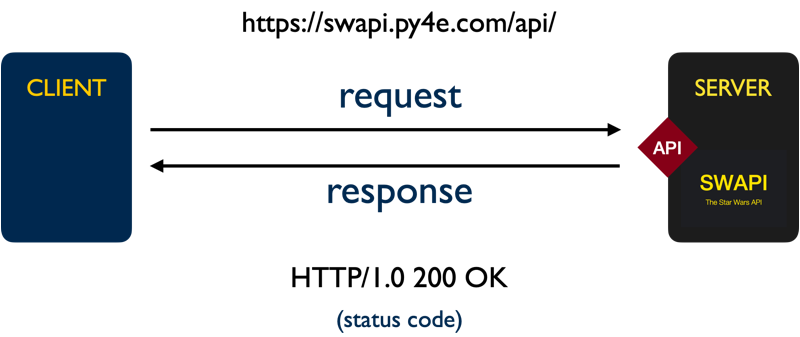

# SI 506 Lecture 21

## Topics

1. HTTP Request/Response cycle
2. Sorting with built-in function `sorted()` and `list.sort()` method (part I)
   1. Controlling the sort order with a user-defined function
3. Challenges
   1. Challenge 01
   2. Challenge 02
   3. Challenge 03
   4. Challenge 04
   5. Challenge 05
   6. Challenge 06

<br />

## Vocabulary

* __API__: Application Programming Interface that specifies a set of permitted interactions between
  systems.
* __HTTP__: The Hypertext Transport Protocol is an application layer protocol designed to facilitate
  the distributed transmission of hypermedia. Web data communications largely depends on HTTP.
* __JSON__: Javascript Object Notation, a lightweight data interchange format.
* __Querystring__: That part of a Uniform Resouce Locator (URL) that assigns values to specified
  parameters.
* __Resource__: A named object (e.g., document, image, service, collection of objects) that is both
  addressable and accessible via an API.
* __URI__: Uniform Resource Identifier that identifies unambiguously a particular resource.
* __URL__: Uniform Resource Locator is a type of URI that specifies the _location_ of a resource on
  a network and provides the means to retrieve it.
* __URN__: Uniform Resource Name is a type of URI that provides a unique identifier for a resource
  but does not specify its location on a network.

<br />

## 1.0 HTTP Request/Response cycle

The `swapi_get_test.py` script utilizes the `requests` module to send a message (known as a _request_)
to a remote server. The message is sent over HTTP (Hypertext Transfer Protocol), an application
layer protocol that supports data exchange between clients and servers. The server replies with a
message (known as a _response_). If the client is authorized to access the requested data (known
as a _resource_) identified by the provided Uniform Resource Identifier (in our case a URL) the
response will contain a representation of the resource, usually in the form of a JSON document.

HTTP and its extension HTTPS (Hypertext Transfer Protocol Secure) rely on lower level transport
layer protocols such as the Transmission Control Protocol (TCP) or the User Datagram Protocol (UDP)
to transmit packets of data between a client and a server. TCP privileges reliable
message delivery over speed and requires the server to acknowledge the receipt of data and permit
retransmission. UDP privileges speed over reliability and offers no guarantee of message delivery.
Exchanging messages with SWAPI leverages HTTPS over TCP and the still lower-level Internet Protocol
(IP).

An HTTP request consists of an HTTP verb (e.g., `GET`), a resource identifier (e.g.,
`https://swapi.py4e.com/api/people/10/`), the protocol version (`HTTP/1.1`) and optional headers and
an optional body (itself a resource). An HTTP response consists of the protocol version, status code
(e.g., `200`), status message (e.g., `OK`), headers, and an optional body (the requested resource).

The HTTP request methods utilized most frequently include `GET`, `PUT`, `POST`, and `DELETE`.
Other HTTP methods include `CONNECT`, `HEAD`, `OPTIONS`, `PATCH` and `TRACE`.

:bulb: For SI 506 you need only concern yourself with the `GET` method.

<br />
    
<br />

The Python [requests](https://docs.python-requests.org/) package abstracts away much of the
complexity associated with creating an HTTP request. In the case of `swapi_test.py` we need only
pass a URL to the `request` library's `get()` function to initiate a valid HTTP `GET` request. The
`get()` function's return value is an instance of `request.Response`, an object which contains the
JSON-encoded representation of the requested resource. We can access the `response.text` property
to return the JSON documents as a string. Better yet, we can call the `response.json()` method in
order to decode the JSON document into a dictionary.

<br />

## 2.0 Sorting with the built-in function `sorted()` and `list.sort()` method (part I)

In earlier lectures I included "bonus" code illustrating how to sort lists and dictionaries using
the built-in function `sorted()` and the `list.sort()` method. For example, I sorted NYT Times
article subject dictionaries employing a dictionary comprehension and the built-in function
`sorted()`:

```python
# Sort dict items
subjects = {k: v for k, v in sorted(subjects.items())}
```

I sorted counts of NYT Time article keywords employing a dictionary comprehension, the built-in
function `sorted()` and an anonymous function called a `lambda`.

```python
# Sort by value (reversed = -x[1]), then by key (x[0])
keyword_counts = {k: v for k, v in sorted(keyword_counts.items(), key=lambda x: (-x[1], x[0]))}
```

You will learn how to write comprehensions next week and lambdas the week after. In the meantime I
want to show you how to sort lists using the `sorted()`, `list.sort()` and a user-defined function.

First, let's review the built-in function `sorted()`. Passing an _iterable_ to the function will
return a _new_ list with the elements in _ascending_ order. Consider the following select list of
UMSI course numbers extracted from the UMSI course
[catalog](https://www.si.umich.edu/programs/courses):

```python
courses = [618, 506, 579, 602, 544, 630, 561, 507, 539, 564, 664, 504]
```

Passing the list to `sorted()` results in a new list being returned with its integer elements sorted
in ascending order:

```python
courses_sorted = sorted(courses)
# [504, 506, 507, 539, 544, 561, 564, 579, 602, 618, 630, 664]
```

If you wanted to reverse the sort order and the return the course numbers in _descending_ order you
can pass to `sorted()` the optional keyword argument `reverse=True`:

```python
courses_sorted = sorted(courses, reverse=True)
# [664, 630, 618, 602, 579, 564, 561, 544, 539, 507, 506, 504]
```

Recall that `sorted()` returns a new list. If you want to sort the `courses` list without generating
a new list you can call the `list.sort()` method. This performs an _in-place_ operation, mutating
`courses` directly, and returning `None` to the caller implicitly.

```python
courses.sort() # ascending order
courses.sort(reverse=True) # descending order
```

:exclamation: Note that you cannot use `sorted()` or `list.sorted()` to sort lists that contain
non-compatible data types (e.g., a mix of strings and integers).

```python
mix = [1, 2, 'One', 'one', 'ONE', 1.1, '1', '01', 506]
mix_sorted = sorted(mix) # Triggers TypeError
mix.sort() # Triggers TypeError
```

## 2.1 Controlling the sort order with a user-defined function

You can provide your own sort algorithm (i.e., process or set of rules) by creating a user-defined
function and passing the __name__ of the function to either the built-in function `sorted()` or
`list.sort()` method using the keyword argument `key`.

In the following example a list of SWAPI planet dictionaries is sorted by each planet's population
value. This is achieved by implementing the function named `sort_by_population` and then passing the
name of the function bound to the keyword argument `key` to either `sorted()` or `list.sort()`:

```python
def sort_by_population(entity):
    """Tries to return an < entity > dictionary's population value converted to
    an integer.

    WARN: If the < entity > population value cannot be converted to an integer the
    function returns zero (0) to the caller.

    Parameters:
        entity (dict): dictionary to parse

    Returns:
        int: returns an integer if the original value can be cast to a string;
             otherwise, returns zero (0).
    """

    try:
        return int(entity['population'])
    except:
        return 0

# Sort by population size (ascending order, smallest to largest)
planets_sorted = sorted(planets, key=sort_by_population) # name of function only

# Sort by population size (descending order, largest to smallest)
planets_sorted = sorted(planets, key=sort_by_population, reverse=True)

# Sort in-place: list.sort() method
planets.sort(key=sort_by_population, reverse=True)
```

:exclamation: Bear in mind that limitations exist with this approach:

1. The function passed to `sorted()` or `list.sort()` can only define a _single_ parameter.
   Provisioning the function with multiple parameters will trigger a `TypeError` when it is passed
   to `sorted()` or `list.sort()`.

2. The function _must_ be able to process all values encountered. Otherwise a `ValueError` will be
   be triggered .

In the SWAPI planets example certain planets possess a population value of "unknown" that
cannot be converted to an integer.

```json
{
    "name": "Hoth",
    ...
    "population": "unknown",
    ...
    "url": "https://swapi.py4e.com/api/planets/4/"
  }
```

The function `sort_by_population()` handles this challenge with
`try` and `except` blocks that return a value of zero (`0`) if a value cannot be converted to
an integer by passing it to the built-in `int()` function. This ensures that all values can be
processed when sorting.

<br />

## 3.0 Challenges

<br />

## 3.1 Challenge 01

__Task__: Retrieve a SWAPI representation of Chewbacca and supplement the representation with
homeland and species data.

:bulb: See the previous lecture notes and code for examples of how to interact with SWAPI.

1. In `main` call the function `get_swapi_resource()` passing the correct URL value and the
   querystring name-value pair "search" (name) and "chewbacca" (value) as arguments. Retrieve a
   response that contains a representation of the Wookiee Chewbacca (a.k.a Chewie). Assign the
   return value to a variable named `response`.

   :exclamation: The JSON response that is decoded into a dictionary is structured as follows:

   ```python
   {
     'count': 1,
     'next': None,
     'previous': None,
     'results': [
       {< Chewbacca >}
     ]
   }
   ```

2. Access the Chewbacca dictionary from the response object and assign it to variable named
   `chewie`.

3. Call the function `write_json()` and write `chewie` to a file named `stu-chewie.json` as JSON.

<br />

## 3.2 Challenge 02

__Task__: Enrich the current dictionary representation of Chewbacca with his SWAPI homeland and
species data.

1. Access the `homeworld` URL in `chewie` and retrieve the Wookiee's home planet by calling
   `get_swapi_resource()` and passing the "homeworld" URL to it as an argument
   (_no search string required_). Map (i.e., assign) the return value to the `chewie` dictionary's
   "homeworld" key.

2. Access the `species` URL in `chewie` and retrieve the Wookiee's species by
   calling `get_swapi_resource()` and passing the URL to it as an argument (again,
   _no search string required_). Assign the return value to the `chewie` dictionary's "species"
   key.

   :exclamation: Take heed, the expression `chewie['species']` resolves to a `list`.

3. Call the function `write_json` and write the "enriched" `chewie` dictionary to a file named
   `stu-chewie_enriched.json`.

<br />

## 3.3 Challenge 03

__Task__: Combine SWAPI T-65 X-wing starfighter data with data sourced from the
[Wookieepedia](https://starwars.fandom.com/) X-wing starfighter "Legends"
[article](https://starwars.fandom.com/wiki/X-wing_starfighter/Legends).

1. In `main()` call `get_swapi_resource()` and retrieve a dictionary representation of a
   __T-65 X-wing__ starfighter. Assign the return value to a variable named `swapi_x_wing`.

   :bulb: Employ the search string "t-65 x-wing" rather than "x-wing" as there are two models of
   X-wing starfighters available for retrieval. If you opt to pass "x-wing" as the search string
   you will need to loop over the `result` list elements in order to access the T-65 X-Wing
   starfighter.

2. Call the function `read_csv_to_dicts` and retrieve the Wookieepedia starfighter data stored in
   the file `wookieepedia_starships.csv`. Assign the list of dictionaries to the variable named
   `wookiee_starships`.

3. Implement a `for` loop to access the T-65 Starfighter dictionary in the `wookiee_starships` list.
   Filter on each dictionary's "model" name. Assign the starfighter dictionary to a variable named
   `wookiee_x_wing`.

4. __Update__ the `x_wing` dictionary with the `wookiee_x_wing` dictionary, __if and only if__, the
   value assigned to `wookiee_x_wing` is _truthy_.

   :bulb: If you don't recall how to update one dictionary with another have a look at w3school's
   ["Python Dictionary Methods"](https://www.w3schools.com/python/python_ref_dictionary.asp) page;
   there is a handy `dict` method available to accomplish this task.

5. Call the function `write_json` and write `x_wing` to a file named
   `stu-x_wing_enriched.json` as JSON.

<br />

## 3.4 Challenge 04

__Task__: Implement a function that removes key-value pairs from a passed in dictionary. Then use
the function to "thin out" the T-65 X-Wing starfighter dictionary.

1. Implement the function named `drop_data`. Review the function's docstring regarding its expected
   behavior, parameters, and return value.

   __Function requirements and hints__

   1. The tuple of key names that you pass to the function will be employed as a filter that targets
      matching key-value pairs for removal from the passed in dictionary.

   2. Leverage a certain built-in function to perform the removals.

2. After implementing the function return to `main()`.

3. Call the function `drop_data` passing to it as arguments `x_wing` and `drop_keys`. Assign the
   return value to `x_wing`.

4. Call the function `write_json` and write `x_wing` to a file named `stu-x_wing.json` as JSON.

<br />

## 3.5 Challenge 05

__Task__: Replace the list of `x_wing` pilot URLs with dictionary representations of each pilot.
When adding the pilot dictionaries to `x_wing` add the pilot's home planet and drop unneeded
key-value pairs.

1. Utilize a `for i in range()` loop to loop over the `x_wing` dictionary's __"pilots" list__.
   Provide `range()` with the appropriate `stop` value (an expression).

2. In the loop block peform the following tasks:

   1. Access each `x_wing` pilot's URL and pass it to the function `get_swapi_resource()` as the
      argument. Assign the return value to a variable named `pilot`.

   2. Call the function `drop_data()` and pass `pilot` and `drop_keys` to it as arguments. Remove
      unneeded key-value pairs. Assign the return value to `pilot`.

   3. Call the function `get_swapi_resource()` and pass the pilot's "homeworld" URL to it as the
      argument. Assign the return value to a variable named `homeworld`.

   4. Call the function `drop_data()` and pass `homeworld` and `drop_keys` to it as arguments.
      Remove unneeded key-value pairs. Map (i.e., assign) the return value to `pilot` dictionary's
      "homeworld" key.

   1. Finally, assign the mutated `pilot` dictionary to the `x_wing` dictionary's "pilots" list by
      replacing the URL string element used to retrieve the SWAPI pilot resource with `pilot`.

3.  After updating `x_wing` call the function `write_json` and write `x_wing` to a file named
    `stu-x_wing_pilots.json` as JSON.

<br />

## 3.6 Challenge 06

__Task__: Retrieve Luke Skywalker and the astromech droid R2-D2 from SWAPI. Get R2-D2's home world.
Remove all unneeded key-value pairs. Assign Luke and R2-D2 as the `x_wing` crew members.

1. Access Luke Skywalker from the `x_wing` "pilots" list. Luke is conveniently the first element in
   the list. Assign the Skywalker dictionary to a variable named `luke`.

2. After retrieving Luke from the list, remove the `x_wing` `pilots` key-value pair. Pass
   __a single item tuple__ containing the appropriate key name to `drop_data` to accomplish the
   task.

3. Retrieve a SWAPI representation of astromech droid
   [R2-D2](https://starwars.fandom.com/wiki/R2-D2). Assign the return value to a variable named
   `r2`.

4. Remove unneeded key-value pairs from `r2`.

5. Retrieve R2-D2's home planet. Remove unneeded key-value pairs from the planet. Map (i.e., assign)
   the planet dictionary to the "homeworld" key in `r2`.

6. Next, assign `luke` and `r2` as `x_wing` crew members. Create a "crew members" dictionary
   comprising the following keys:

   * pilot
   * astromech_droid

   Assign `luke` as the "pilot" and `r2` as the "astromech_droid".

7. Mutate `x_wing` by adding a new "crew_members" key-value pair to the dictionary.

   ```python
   'crew_members': {'pilot': luke, 'astromech_droid': r2}
   ```

8. Call the function `write_json` and write `x_wing` to a file named `stu-x_wing_crew.json` as JSON.
